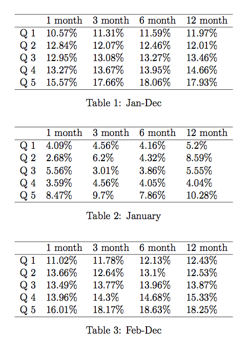
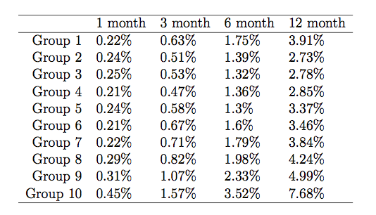
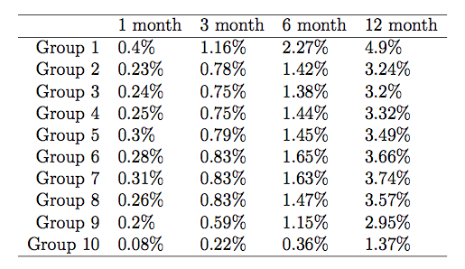

Evidence of Predictable Behavior of Security Returns
========================================================
author: Stephanie Li and Sohum Patnaik
date: January 28, 2015

Objective
========================================================
type: sub-section
Show momentum exists through the total returns of individual securities

- positive serial correlation between lagged returns and actual returns
- total returns of future returns based on sorting by past returns
- total returns of future returns based on sorting by volume

Introduction
========================================================
type: sub-section
- market efficiency
- source of data
- how we cleaned the data

Positive Serial Correlation
========================================================
type: sub-section
- sorted data by company size into quintiles
- getting correlation between lagged returns and actual returns
- January Effect

Results
========================================================
type: sub-section

Forming a Portfolio
========================================================
type: sub-section
- sorted data into deciles by increasing past total returns (1, 3, 6, and 12 month)
- P1 had lowest past total returns, P10 had greatest past total returns
- after sorting, display future 1, 3, 6, 12 month returns

Portfolio Performance
========================================================
type: sub-section

Extension
========================================================
type: sub-section

- inverse relationship between volume and future returns
- predictability of returns exists to some extent

Possible Explanations
========================================================
type: sub-section
- less obvious change in serial correlation between monthly and 12-month lagged returns and current total returns
- difference in extreme deciles slightly smaller
- greater liquidity from stocks in data
- increased market efficiency

Conclusion
========================================================
type: sub-section
- correlation between past returns and current returns
- direct relationship between company size and total returns
- stocks that did well in the past did better than stocks that did poorly in the past
- inverse relationship between volume and total returns
- in all findings results found, momentum exists
